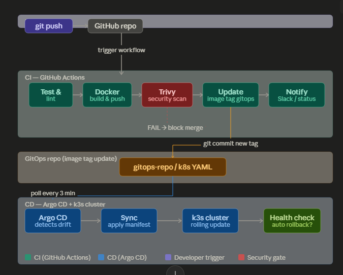

## Architecture


```bash
# Repo 1: source code aplikasi
devdash/                          ← kamu sudah punya ini
├── api-gateway/
├── weather-service/
├── quote-service/
└── .github/workflows/
    └── ci.yml                    ← GitHub Actions CI

# Repo 2: konfigurasi Kubernetes (GitOps repo)
devdash-gitops/                   ← buat repo baru ini di GitHub
├── apps/
│   ├── api-gateway/
│   │   └── deployment.yaml       ← image tag di sini yang diupdate CI
│   ├── weather-service/
│   │   └── deployment.yaml
│   └── quote-service/
│       └── deployment.yaml
├── argocd/
│   ├── app-api-gateway.yaml
│   ├── app-weather-service.yaml
│   ├── app-quote-service.yaml
│   └── appset-devdash.yaml      ← ApplicationSet (1 file untuk semua)
└── security/
    └── sealed-secrets/
```

Masalah umum: credential (API key, password DB) tidak boleh di-commit ke Git. Solusinya adalah Sealed Secrets — encrypt secrets sehingga aman disimpan di gitops repo. Kenapa tidak menggunakan Kubernetes Secret? karena Secret sebenarnya tidak dienkripsi (tidak disandikan). Kubernetes hanya menggunakan teknik Base64 Encoding. siapa pun yang melihat kode tersebut bisa men-decode (membuka) password aslinya hanya dalam waktu 1 detik di internet.
```bash
# Install Sealed Secrets controller di k3s
kubectl apply -f https://github.com/bitnami-labs/sealed-secrets/releases/latest/download/controller.yaml

# 1. Deteksi versi terbaru secara otomatis dari GitHub
KUBESEAL_VERSION=$(curl -s https://api.github.com/repos/bitnami-labs/sealed-secrets/releases/latest | grep '"tag_name":' | sed -E 's/.*"v([^"]+)".*/\1/')

# Install kubeseal CLI tool
wget "https://github.com/bitnami-labs/sealed-secrets/releases/latest/download/kubeseal-${KUBESEAL_VERSION}-linux-amd64.tar.gz"

# 3. Ekstrak hanya file aplikasi "kubeseal"-nya saja dari dalam arsip
tar -xvzf kubeseal-${KUBESEAL_VERSION}-linux-amd64.tar.gz kubeseal

# 4. Pindahkan ke direktori bin agar bisa dijalankan seperti perintah Linux biasa
sudo install -m 755 kubeseal /usr/local/bin/kubeseal

# 5. Bersihkan file sampah hasil download
rm kubeseal-${KUBESEAL_VERSION}-linux-amd64.tar.gz

# 6. Cek apakah instalasi sukses
kubeseal --version

# --- Cara pakai: ---

# 1. Buat Secret biasa dulu (jangan di-apply!)
kubectl create secret generic devdash-secrets \
  --from-literal=DB_PASSWORD="supersecret123" \
  --from-literal=SLACK_WEBHOOK="https://hooks.slack.com/xxx" \
  --dry-run=client -o yaml > /tmp/raw-secret.yaml

# 2. Encrypt jadi SealedSecret (ini yang di-commit ke git)
kubeseal --format=yaml < /tmp/raw-secret.yaml > security/sealed-secrets/devdash-sealed.yaml

# 3. File sealed bisa di-commit ke gitops repo dengan aman
git add security/sealed-secrets/devdash-sealed.yaml
git commit -m "security: add sealed secrets for devdash"

# 4. Apply ke cluster — controller decrypt otomatis
kubectl apply -f security/sealed-secrets/devdash-sealed.yaml
```
